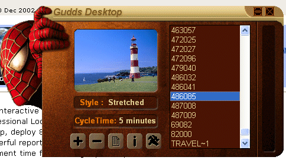



## Create transparent skinned forms

### Description

You can create a form of any iregular shape like a skinned form. Just have the image which you want to be there with the form and call a function to create the shaped form. the transparent color can be specified otherwise it will take the (0,0) pixel color as transparent color.
 
### More Info
 
the function requires the handle of the form and a picturebox control, where the source picture is stored, as input.

             |
---                |---
**Submitted On**   |2002-11-14 03:25:04
**By**             |[Kundan](https://github.com/Planet-Source-Code/PSCIndex/blob/master/ByAuthor/kundan.md)
**Level**          |Intermediate
**User Rating**    |4.5 (67 globes from 15 users)
**Compatibility**  |VB 5\.0, VB 6\.0
**Category**       |[Coding Standards](https://github.com/Planet-Source-Code/PSCIndex/blob/master/ByCategory/coding-standards__1-43.md)
**World**          |[Visual Basic](https://github.com/Planet-Source-Code/PSCIndex/blob/master/ByWorld/visual-basic.md)
**Archive File**   |[Create\_tra14970711142002\.zip](https://github.com/Planet-Source-Code/kundan-create-transparent-skinned-forms__1-40609/archive/master.zip)

